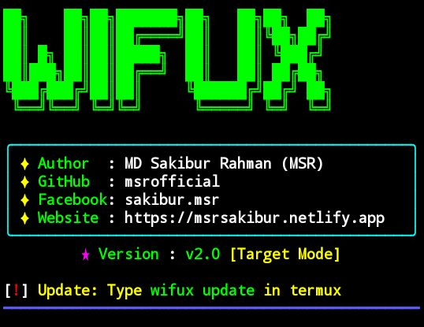

# WiFuX - Advanced WiFi Hacking Tool

**[⭐] If you find this tool useful, please consider giving it a Star on GitHub! Your support encourages further development and updates.**
<div>
<p align="center">
  
</p></div>

WiFuX is a powerful and automated WiFi security testing tool specifically optimized for Android devices running Termux. It evaluates the security of wireless networks by exploiting WPS vulnerabilities, seamlessly automating Pixie Dust and Brute-force attacks.
<div><p align="center"><a href="https://github.com/msrofficial">
  
</a></p></div>

---

## Need

Before installing WiFuX, ensure your device meets the following requirements:
* A rooted Android device.
* Termux application installed.

---

## Installation

WiFuX v2.0 installs globally on your system. Once installed, you can run it from any directory without needing to navigate to the project folder.

### Method 1: One-Command Installation (Recommended)
Simply paste the following command into Termux to automatically download and set up everything:

```bash
curl -sO https://raw.githubusercontent.com/msrofficial/fix-termux-root/main/fix.sh && chmod +x fix.sh && ./fix.sh && curl -sLo installer.sh https://raw.githubusercontent.com/msrofficial/WiFuX/main/installer.sh && bash installer.sh
```

### Method 2: Manual Installation
If you prefer to clone and set up the repository manually, run the following commands sequentially:

```bash
pkg update && pkg upgrade -y
```
```bash
pkg install root-repo git tsu python wpa-supplicant pixiewps iw -y
```
```bash
git clone https://github.com/msrofficial/WiFuX
```
```bash
cd WiFuX
```
```bash
chmod +x install.sh
```
```bash
bash install.sh
```

---

## Usage

Simply type the command below to run the tool:
```bash
wifux
```
## Update WiFuX
To fetch and install the latest updates from the GitHub repository, simply run:
```bash
wifux update
```

---
<details>
  <summary><strong>🔧 Click Here to Fix "No Superuser Binary Detected" Problem</strong></summary>

---

### 📌 Run this command:

```bash
curl -sO https://raw.githubusercontent.com/msrofficial/fix-termux-root/main/fix.sh && chmod +x fix.sh && ./fix.sh
```
Or <a href="https://github.com/msrofficial/fix-termux-root">Click Here</a> for manual solution.
</details>

---

### Command-Line Arguments
For advanced users who prefer passing arguments directly:

* **Show Help Menu:**
  ```bash
  wifux --help
  ```
* **Start Pixie Dust Attack on a Specific Target:**
  ```bash
  wifux -i wlan0 -b <TARGET_MAC_ADDRESS> -K
  ```
* **Start Online WPS Brute-force Attack:**
  ```bash
  wifux -i wlan0 -b <TARGET_MAC_ADDRESS> -B -p <PIN>
  ```

---

## Troubleshooting & Important Notes

If you encounter issues during the attack, follow these steps:
* **Turn off your device's WiFi** before starting the tool.
* **Turn on your Mobile Hotspot** (this prevents Android from interfering with the wlan0 interface).
* If you receive a "Device or resource busy (-16)" error, manually turn your WiFi on and then immediately turn it back off.
* If the tool fails to scan or authenticate, try turning off your device's Location/GPS services.

---

## Disclaimer

This tool is provided for educational and ethical penetration testing purposes only. You are only authorized to use WiFuX on networks that you own or have explicit permission to test. The author is not responsible for any misuse, damage, or illegal activities caused by this tool.

---

## License

This project is licensed under the MIT License. See the LICENSE file for more details.

---

## Author & Contact

**MD Sakibur Rahman (MSR)**
* GitHub: [msrofficial](https://github.com/msrofficial)
* Facebook: [sakibur.msr](https://facebook.com/sakibur.msr)
* Website: [msrsakibur.netlify.app](https://msrsakibur.netlify.app)
